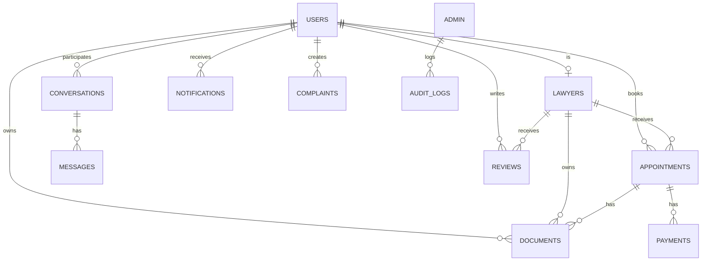

# Legal Connect — ER Diagram

```mermaid
erDiagram
    USERS ||--o| LAWYERS : "is"
    USERS ||--o{ APPOINTMENTS : "books"
    LAWYERS ||--o{ APPOINTMENTS : "receives"
    USERS ||--o{ DOCUMENTS : "owns"
    LAWYERS ||--o{ DOCUMENTS : "owns"
    APPOINTMENTS ||--o{ DOCUMENTS : "has"
    USERS ||--o{ CONVERSATIONS : "participates"
    CONVERSATIONS ||--o{ MESSAGES : "has"
    USERS ||--o{ REVIEWS : "writes"
    LAWYERS ||--o{ REVIEWS : "receives"
    USERS ||--o{ NOTIFICATIONS : "receives"
    USERS ||--o{ COMPLAINTS : "creates"
    APPOINTMENTS ||--o{ PAYMENTS : "has"
    ADMIN ||--o{ AUDIT_LOGS : "logs"
```

*(Collections detailed in `docs/architecture.md` and each model module.)*
